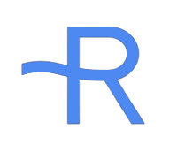

  

  
# 
👋 Raghav Anand's Portfolio Website

### 
 Hosted @ <a href="https://zeethx.github.io">zeethx.github.io</a>, built with React

 

 
 

<!--  -->

---

### Hello everyone!

This is a static website, displaying information about myself, my projects, and ways to contact me.
This website was built with react and plain CSS

### Dependencies Used:

- react
- react-router-hash-link
- react-icons
- gh-pages
- react-ga
- aos

---

### Colors:

| Color      | Hex                                                                       |
| ---------- | ------------------------------------------------------------------------- |
| Sunflower     |  `#ff8d00` |
| Dark Gray  |  `#22262b` |
| Light Gray |  `#5b5b5b` |
